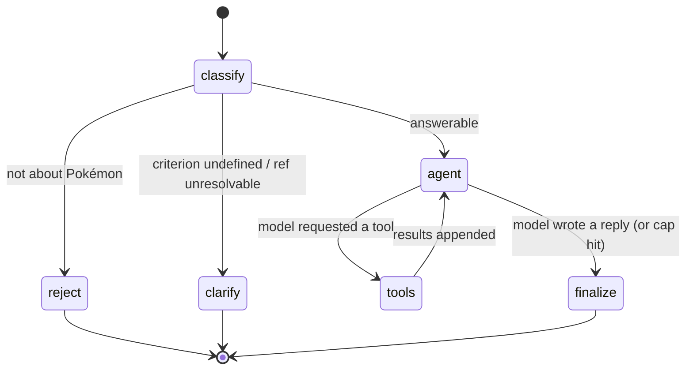

# Pokémon Agent

A conversational agent that answers questions about Pokémon, grounded in **live
[PokéAPI](https://pokeapi.co/docs/v2) data** — and when a question falls outside the
API (e.g. competitive tiers or "which is strongest"), it answers from general
knowledge but says so explicitly rather than passing it off as official data. It
holds multi-turn context (so "What abilities can *it* have?" resolves against the
Pokémon you just asked about), decides for itself which endpoints to call, and
degrades gracefully on bad input.

Built on **LangGraph** as an explicit state machine: a typed state object flows
through nodes, a structured-output classifier gates each turn, and a bounded
`agent ⇄ tools` loop does the retrieval. The graph is decoupled from transport, so
the same agent drives a CLI REPL and a streaming web UI.

---

## Quick start

```bash
python -m venv .venv
.venv\Scripts\activate                 # Windows;  source .venv/bin/activate elsewhere
pip install -r requirements.txt
copy .env.example .env                 # then paste your OPENAI_API_KEY

# Verify everything offline (no API key, no network) — the regression gate:
pytest

# Chat on the command line (needs OPENAI_API_KEY):
python main.py                         # interactive multi-turn REPL
python main.py "What are Charizard's base stats?"   # one-shot

# Chat in the browser (streaming):
uvicorn server:app --reload            # open http://localhost:8000
```

---

## Architecture

One typed `AgentState` flows through every node. `classify` turns the user's turn
into a typed decision; a **deterministic** router branches on it; the answer path is
a bounded tool-calling loop.



```
START ─► classify ─(router)─┬─► reject   ─► END      (polite decline, no LLM/tools)
                            ├─► clarify  ─► END      (one focused question)
                            └─► agent ⇄ tools ─► finalize ─► END   (bounded loop)
```

| Node | Kind | Responsibility |
|---|---|---|
| `classify` | LLM (structured output) | One judgment → typed `Classification` (`query_type`, `route`, `is_followup`). |
| `route_after_classify` | pure Python | Branch on `route`; **force `reject`** if `query_type == not_pokemon` (scope guard). |
| `agent` | LLM (`bind_tools`) | Calls PokéAPI tools or writes the final answer; resolves "it" from history. |
| `tools` | `ToolNode` | Executes the requested tools, appends results, loops back to `agent`. |
| `finalize` | pure Python | Promote the last AI message to `final_reply`. |
| `clarify` | LLM | Ask one clarifying question; end the turn. |
| `reject` | pure Python | Canned out-of-scope decline — no tokens spent. |

### Why a graph and not a chain
A linear chain can't *branch* (answer vs. clarify vs. decline) and can't *loop* (call
a tool, read the result, decide again). This agent needs both, with a typed state as
the single source of truth — exactly what `StateGraph` provides. We use `StateGraph`
directly rather than a prebuilt agent so the control flow is explicit and reviewable.

### Routing: one generic judgment, not a rulebook
The classifier answers a single question per turn: **can the agent give a concrete,
defensible answer from the tools right now?**

- **Yes** — a reasonable default exists, even if the scope is broad → **`answer`** (the
  agent may offer to narrow).
- **No** — a required choice is undefined with no sensible default, *or* a reference
  can't be resolved → **`clarify`**.
- **Not about Pokémon** → **`reject`**.

The distinction is the *kind* of ambiguity, not the breadth of the answer:

| Question | Judgment | Route |
|---|---|---|
| "Which Pokémon are weak to electric?" | Objective metric, broad scope | `answer` (type-level + examples + offer) |
| "Show all fire-type Pokémon" | Objective, just a list | `answer` |
| "Which is stronger, Dragonite or Salamence?" | "Stronger" is undefined | `clarify` |
| "Tell me about it" (no prior Pokémon) | Reference unresolvable | `clarify` |
| "What's the weather?" | Off topic | `reject` |

Specific phrasings live only as a few calibration examples in the classifier prompt —
never as branches in code. The **fuzzy judgment lives in the LLM; determinism lives in
code** (the router branches only on the enum, plus the `not_pokemon → reject` override).

### Multi-turn memory
The graph is compiled with a `MemorySaver` checkpointer. Each conversation is a
`thread_id`; the CLI uses one per session and the web UI generates one per page load
and sends it with every message. The persisted `messages` channel (with the
`add_messages` reducer) is what lets `agent` resolve "it" → the earlier Pokémon.
There is no human-in-the-loop `interrupt` — read-only Q&A has no action to gate.

---

## Tools

Small, typed `@tool` functions (`src/tools.py`) over a separate, testable HTTP client
(`src/pokeapi.py`). The docstring is the spec the model reads. Each returns a **cleaned,
user-friendly dict** — never raw JSON — or `{"error": ...}` on failure.

| Tool | PokéAPI endpoint(s) | Returns |
|---|---|---|
| `get_pokemon` | `/pokemon/{}` | Types, abilities (passive traits, with count) **coupled to** `movepool` count, base stats (+ total), height, weight. |
| `get_pokemon_species` | `/pokemon-species/{}` | Flavor text, generation, legendary/mythical flags, evolves-from. |
| `get_pokemon_moves` | `/pokemon/{}` | The moves a Pokémon can learn (attacks — distinct from abilities): total count + a `limit`-sized sample (default 5, `None` for all). |
| `get_evolution_chain` | `/pokemon-species/{}` → `/evolution-chain/{}` | The evolution **tree** (handles branching, e.g. Eevee), with the trigger per stage. |
| `get_type_matchups` | `/type/{}` | Damage relations both directions + a `limit`-sized sample of the Pokémon of that type (default 5) with the true total. |
| `get_move_details` | `/move/{}` | Type, power, accuracy, PP, damage class, effect. |
| `search_pokemon_by_ability` | `/ability/{}` | Effect text + a `limit`-sized sample of Pokémon that can have it (default 5) with the true total. |
| `compare_pokemon` | `/pokemon/{}` ×N | Base stats of several Pokémon side by side. |

**How the LLM decides to use them.** The `agent` node binds all eight with
`.bind_tools()`. Each turn the model either emits tool calls (executed by `ToolNode`,
whose results are appended to state) or writes a final answer. The loop guard
(`should_continue`) sends it back to `agent` after tools, up to `MAX_TOOL_ITERATIONS`
rounds, then forces `finalize` — so the cycle always terminates. Some questions take
several calls (e.g. a comparison, or species → evolution-chain); the loop handles that
naturally.

The client layer adds the robustness the spec asks for: **input normalization**
("Mr Mime" → `mr-mime`), **response caching** (PokéAPI is near-static and asks clients
to cache; also dedupes within a turn), and **fail-safe errors** (404 / network /
timeout become a clear message, never an exception).

---

## Example conversation

A real transcript from the web UI. The `route … · …` line is the chip the UI renders
from the classifier's typed decision (`route` · `query_type`), so every turn shows the
branch it actually took.

```
you> What type is Pikachu?
     route answer · pokemon_info
bot> Pikachu is an Electric-type Pokémon. It has two abilities: Static (which is its
     primary ability) and Lightning Rod (which is a hidden ability). Pikachu can learn
     a total of 109 moves.

you> What abilities can Bulbasaur have?
     route answer · pokemon_info
bot> Bulbasaur has two abilities: Overgrow (its primary ability) and Chlorophyll
     (which is a hidden ability). Bulbasaur can learn a total of 86 moves.

you> What are Charizard's base stats?
     route answer · pokemon_info
bot> Charizard's base stats are as follows:

     - HP: 78
     - Attack: 84
     - Defense: 78
     - Special Attack: 109
     - Special Defense: 85
     - Speed: 100

     The total of these base stats is 534. Charizard is a Fire/Flying-type Pokémon and
     has two abilities: Blaze (primary) and Solar Power (hidden). It can learn a total
     of 131 moves.

you> Which Pokémon evolve from Eevee?
     route answer · evolution
bot> Eevee can evolve into several different Pokémon, each through specific methods:

     1. Vaporeon — Evolve by using a Water Stone.
     2. Jolteon  — Evolve by using a Thunder Stone.
     3. Flareon  — Evolve by using a Fire Stone.
     4. Espeon   — Evolve by achieving high friendship during the day.
     5. Umbreon  — Evolve by achieving high friendship during the night.
     6. Leafeon  — Evolve by leveling up in a specific location (in some games).
     7. Glaceon  — Evolve by leveling up in a specific location (in some games).
     8. Sylveon  — Evolve by leveling up with a high friendship while knowing a
        Fairy-type move.

     These evolutions provide a variety of types and abilities for Eevee.
```

Note the branching evolution tree in the last turn (Eevee's eight-way split), and that
abilities are consistently reported *coupled to* the movepool count — the data contract
in `get_pokemon` is what keeps the model from conflating abilities with moves. The
`clarify` and `reject` branches aren't exercised above; they're covered in
`test_router.py`, and multi-turn reference resolution in `test_multiturn.py`.

---

## Validation

Offline, deterministic, no API key — run with `pytest` (the regression gate). Two
seams keep it hermetic: an `httpx.MockTransport` serving canned PokéAPI JSON, and a
duck-typed `ScriptedLLM` standing in for the model (`GenericFakeChatModel` can't do
`.with_structured_output()` or `.bind_tools()`).

| Suite | What it proves |
|---|---|
| `test_pokeapi_client.py` | URL construction, normalization, parsing/cleaning, 404 & network → error, caching. |
| `test_tools.py` | Each tool's clean output, error passthrough, **evolution-tree branching**, side-by-side compare. |
| `test_router.py` | Branch selection + the `not_pokemon → reject` override + criterion-vs-scope routing. |
| `test_graph_loop.py` | Graph compiles with the right nodes; the loop guard terminates at the cap. |
| `test_nodes.py` | `reject` is LLM-free; `finalize` and `classify` wiring. |
| `test_multiturn.py` | **Headline:** a follow-up resolves against persisted history across two turns. |
| `test_streaming.py` | SSE translation (tokens, chip, fallback, errors) + the LangGraph stream contract. |
| `test_live.py` (`-m live`) | Grounding against the **real** PokéAPI (opt-in; off by default). |

40 offline tests pass in ~3s; the 3 live checks pass against the real API when run
with `pytest -m live`.

---

## Trade-offs

- **Classify gate over a pure agent loop** — one extra cheap LLM call per turn, but
  control flow stays deterministic and inspectable, and earns the `clarify`/`reject`
  branches. Judgment lives in the LLM, routing in code.
- **Clarify-first on ambiguous criteria** over answering with an assumption — an extra
  round-trip, chosen for a more cautious, conversational feel; it also makes `clarify` a
  first-class, well-tested path. (The spec permits either.)
- **Type-level answers + offer to drill in** over exhaustive enumeration — "weak to
  electric" answered from type relations plus a cheap single-Pokémon follow-up, instead
  of dozens of API calls that could hit the loop cap.
- **List size is a `limit` argument, not a hard cap** — every list result defaults to a
  5-item sample and always reports the true total; the agent widens it (`limit=10`, or
  `None` for all) when the user asks. The presentation choice lives in the data contract,
  not as a number the prompt hopes the model honors.
- **In-process tools, not MCP** — single owner, single consumer; MCP would be premature
  distribution. Reversible later if a real shared boundary appears.
- **`MemorySaver` (in-process), not a database** — right-sized for the exercise;
  conversation memory resets when the process restarts.
- **`compare_pokemon` as a dedicated tool** even though the agent could call
  `get_pokemon` twice — matches the spec's tool list and yields cleaner comparisons.

---

## Layout

```
src/
  state.py     typed AgentState (single source of truth)
  schemas.py   Pydantic decision shapes (structured output)
  config.py    env-driven settings (frozen dataclass)
  llm.py       model factory (swappable provider)
  pokeapi.py   PokéAPI HTTP client: fetch, cache, normalize, parse
  tools.py     @tool functions (LLM-facing surface)
  nodes.py     node functions + the deterministic router
  graph.py     graph assembly, edges, loop guard, checkpointer
server.py      FastAPI + SSE transport (decoupled from the agent)
web/index.html dependency-free chat UI
main.py        CLI REPL / one-shot entry
tests/         offline pytest suite (+ opt-in live checks)
```

Configuration (`.env`, see `.env.example`): `OPENAI_API_KEY`, `OPENAI_MODEL`,
`OPENAI_TEMPERATURE`, `MAX_TOOL_ITERATIONS`, `POKEAPI_BASE_URL`, `HTTP_TIMEOUT`.
